# <center>信用违约预测</center>

|  姓名  |    学号    |
| :----: | :--------: |
| 余若涵 | 3180105412 |
| 范源颢 | 3180103574 |

格式：小四 1.25倍行距 10页以上 （意思是最后需要转成word格式？）


### 一、研究背景与意义

商业银行风险管理问题是商业银行经营管理的核心，风险管理的质量优劣直接关系到商业银行的生死存亡。而客户信用评级预估又是银行风险管控非常重要的组成部分，银行借给债务人的借款如果无法按时收回，银行的资产将面临不必要的风险，同时债务人的信用也会受到影响。为此，银行需要在借款之前根据数据估计客户的还款能力，评价信用风险等级。

为了扩大无贷款经验人群的金融包容性，确保有还款能力的客户可以获得贷款，银行需要利用各种替代数据（包括电信、交易信息）来预测客户的还款能力。这正是我们的项目所关注的。本项目中，我们的目的是：根据客户的基本信息、历史表现判断客户是否有能力及时还清贷款。


### 二、国内外研究现状与存在问题

人工智能时代的到来，给金融风控领域带来了全新的机遇与挑战。据Forrester咨询公司一项调查显示，全球380位企业首席高管的调查中，42%的高管都将欺诈列为对商业成功和客户满意度的首要威胁。从欺诈现状来看，国内外企业都面临着巨大的欺诈风险。这个趋势还在不断增长，数字金融欺诈手法多样、隐蔽，同时覆盖面广，从传统业务到金融理财，账户盗用到经济损失。除此之外，还信用数据缺失、风控盲点等问题也一直困扰着业界。

在传统风控环节中，信息不对称、成本高、时效性差、效率低等问题，使得难以满足业务的快速增长引发的信贷增长。而风控引入人工智能技术，使得贷前审核、贷中监控和贷后管理、监管合规等环节，都能提高金融科技产品质量及服务效率。

智能风控能不仅能有效提高金融服务的效率和安全性，降低风控成本，还能促进风险管理差异化和业务人性化，在金融科技业中有着重要作用。所以近年来无论是传统金融机构、消费金融机构还是互联网金融公司，都在加紧智能化系统建设或者对外合作，实现智能化风控。

但目前，智能风控主要最主要的面临的挑战主要包括数据的全面性、真实性及数据挖掘效率等。智能风控目前还是比较依赖大数据还有专家规则，只有在正确数据基础之上才能正结论，当数据量很大时，数据真实性及是否数据被污染，无法进行有效鉴别。


### 三、研究目标与研究内容

本项目中，我们的主要任务是：根据客户的基本信息、历史表现判断客户是否有能力及时还清贷款。这是标准的有监督分类问题。

我们将从以下几个方面展开我们的项目。首先，对数据集进行了解。包括数据规模、各个特征的意义、数据缺失情况等等，并结合可视化工具探索数据中隐藏的关系。之后，我们将进行特征工程：尝试衍生新的特征以及去除不必要的特征，以此来提高模型的效率和正确率。最后，我们会尝试使用多个不同的模型进行训练和预测，并对模型效果进行评估。


### 四、数据集分析

#### 4.1 数据集基本信息

本项目中，我们使用的是由Home Credit公司提供的贷款信息数据集。数据集包含application_train.csv和application_test.csv两个文件。训练集共提供307511条记录，每条记录包含121个特征和1个Target列；测试集包含48744条记录。

数据集中的每条记录都表示了一次贷款，Target的0/1值反映了借款人是否按时还款。121个特征中，有106个数值特征和16个标称特征，这些特征可分为以下四类(只列出部分)：

##### 1. 借款人基本信息

CODE_GENDER - 性别，

DAYS_BIRTH - 客户年龄，

CNT_CHILDREN - 子女数，

CNT_FAM_MEMBERS - 家人数，

OCCUPATION_TYPE - 职业，

……

##### 2. 借款人经济背景

FLAG_OWN_CAR - 是否拥有轿车，

FLAG_OWN_REALTY - 是否拥有不动产，

AMT_INCOME_TOTAL - 借款人总收入，

APARTMENT_AVG - 住房评分，

……

##### 3. 本次贷款相关信息

AMT_CREDIT - 信用额度，

AMT_ANNUITY - 贷款年金，

WEEKDAY_APPR_PROCESS_START - 申请贷款的星期，

HOUR_APPR_PROCESS_START - 申请贷款的时间（小时）  ，

……

##### 4. 其他信息

FLAG_MOBIL - 是否提供手机号码，

FLAG_CONT_MOBILE - 手机是否可打通，

REGION_RATING_CLIENT - 所在地区评分，

EXT_SOURCE_1/EXT_SOURCE_2/EXT_SOURCE_3 - 通过其他信息计算的该客户评分，

……


#### 4.2 可视化分析

> note: 这一部分在vis.ipynb中实现。

以下可视化分析针对未经预处理的训练集aplication_train.csv

##### 4.2.1 Target列的分布

```python
app_train['TARGET'].value_counts()
app_train['TARGET'].astype(int).plot.hist()
```

输出：

```
0    282686
1     24825
```


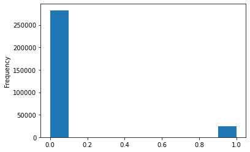

从上图可以看出，训练数据集中的违约记录数远大于未违约记录数，整个训练集是极度不平衡的，这种情况下，模型会花费更多的时间和“精力”去拟合未违约记录(target为0)，所以为了提供模型的效率，在之后我们将采取欠采样或过采样的方法来平衡数据集。


##### 4.2.2 特征与Target的相关性

###### 0) 计算特征与Target的相关性

```python
# Calculate the correlations and sort
correlations = app_train.corr()['TARGET']
correlations = correlations.drop(["TARGET"]).abs().sort_values()
```

###### 1) 10个相关性最小的特征

```python
# 10 least relevant features
correlations.head(10)
```

输出：

```
FLAG_DOCUMENT_20              0.000215
FLAG_DOCUMENT_5               0.000316
FLAG_CONT_MOBILE              0.000370
FLAG_MOBIL                    0.000534
FLAG_DOCUMENT_12              0.000756
AMT_REQ_CREDIT_BUREAU_WEEK    0.000788
AMT_REQ_CREDIT_BUREAU_HOUR    0.000930
FLAG_DOCUMENT_19              0.001358
FLAG_DOCUMENT_10              0.001414
FLAG_DOCUMENT_7               0.001520
Name: TARGET, dtype: float64
```

上面输出结果中的FLAG_DOCUMENT_X特征表示的是在贷款时是否提交某份文件，这类特征有20个，大部分相关性都很低。FLAG_MOBIL和FLAG_CONT_MOBILE表示的分别是客户是否拥有移动电话、电话是否可打通，AMT_REQ特征表示的是申请贷款前客户向信贷局进行查询的次数。

可以看出，这些特征的与Target列的相关性都在万分之一数量级，可以归为very weak级别。在之后的特征工程中我们将会试试它们是否可以衍生出足够好的新特征，或者直接删除这些特征，以减少运算量并提高预测的准确度。

###### 2) 20个相关性最大的特征

```python
# Display 20 most relevant featrues 
corrs = correlations.tail(20)
plt.figure(figsize = (10, 8))
plt.bar( x=0, bottom=corrs.index.astype(str), height=0.25, width=abs(corrs.values), orientation="horizontal")
plt.title('Feature Correlations with target')
```

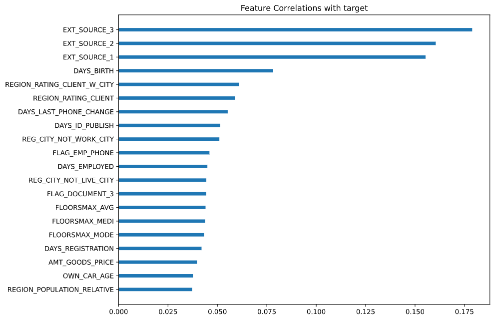

上图中（相关性已取绝对值）排在前三的EXT_SOURCE特征是专业人士依据外部数据对该客户进行的评分，值域为[0, 1]，它们的相关性都超过了0.15；DAY_BIRTH表示的是客户的年龄；两个REGION_RATING特征是对客户所在地的评分，分为三档，用{1, 2, 3}表示。接下来我们将对这些特征进行可视化分析。


##### 4.2.3 客户年龄分布

```python
plt.figure(figsize = (10, 8))
# KDE plot of loans that were repaid on time
sns.kdeplot(app_train.loc[app_train['TARGET'] == 0, 'DAYS_BIRTH'] / -365, label = 'target == 0')
# KDE plot of loans which were not repaid on time
sns.kdeplot(app_train.loc[app_train['TARGET'] == 1, 'DAYS_BIRTH'] / -365, label = 'target == 1')
# Labeling of plot
plt.xlabel('Age (years)'); plt.ylabel('Density'); plt.title('Distribution of Ages');
```

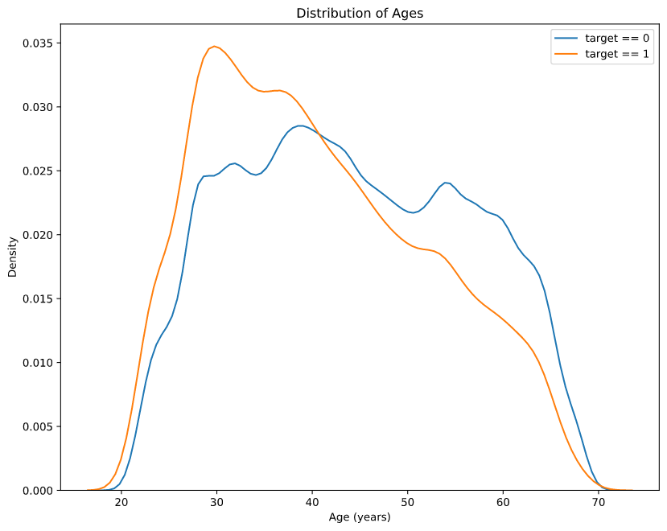

上图中，橘线展示的是违约用户的年龄分布，蓝线为未违约用户的年龄分布。从总可以看出，年轻用户([25, 40]年龄区间内)更容易违约，而年纪较大的用户([50, 65]年轻区间内)则更可能按时付清欠款。

为了更好地分析客户年龄与违约的关系，我们以5年为一个区间宽度进行分箱处理，并用柱状图展示各个区间内的违约率。如下所示。

```python
# Age information into a separate dataframe
age_data = app_train[['TARGET', 'DAYS_BIRTH']]
age_data['YEARS_BIRTH'] = age_data['DAYS_BIRTH'] / -365
# Bin the age data
age_data['YEARS_BINNED'] = pd.cut(age_data['YEARS_BIRTH'], bins = np.linspace(20, 70, num = 11))
age_data.head(10)
# Group by the bin and calculate averages
age_groups  = age_data.groupby('YEARS_BINNED').mean()

plt.figure(figsize = (8, 8))
# Graph the age bins and the average of the target as a bar plot
plt.bar(age_groups.index.astype(str), 100 * age_groups['TARGET'])
# Plot labeling
plt.xticks(rotation = 75); plt.xlabel('Age Group (years)'); plt.ylabel('Failure to Repay (%)')
plt.title('Failure to Repay by Age Group');
```

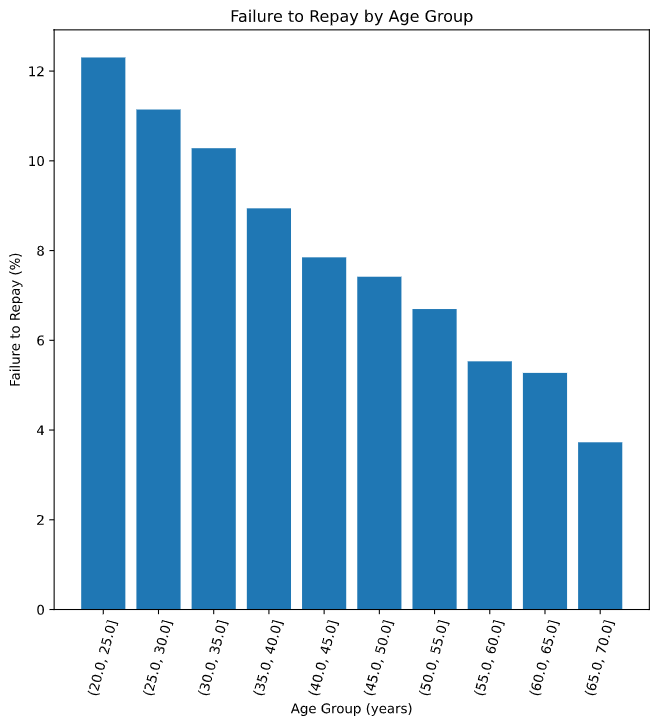

从图中可以看出，随着年龄的增高，违约率一直在下降。年纪最小的三个群体有超过10%的违约率，而年纪最大群体的违约率则低于5%. 这提示我们，年龄将会是一个非常重要的特征，在之后的特征工程中，我们也许可以基于年龄衍生出新的重要特征。


##### 4.2.4 附加特征(EXT_SOURCE)的分布

上文4.2.2的分析显示，三个EXT_SOURCE列与Target列有很大的相关性。下面探究它们的分布。

```python
plt.figure(figsize = (10, 12))

# iterate through the sources
for i, source in enumerate(['EXT_SOURCE_1', 'EXT_SOURCE_2', 'EXT_SOURCE_3']):
    # create a new subplot for each source
    plt.subplot(3, 1, i + 1)
    # plot repaid loans
    sns.kdeplot(app_train.loc[app_train['TARGET'] == 0, source], label = 'target == 0')
    # plot loans that were not repaid
    sns.kdeplot(app_train.loc[app_train['TARGET'] == 1, source], label = 'target == 1')
    # Label the plots
    plt.title('Distribution of %s by Target Value' % source)
    plt.xlabel('%s' % source); plt.ylabel('Density');
    
plt.tight_layout(h_pad = 2.5)
```

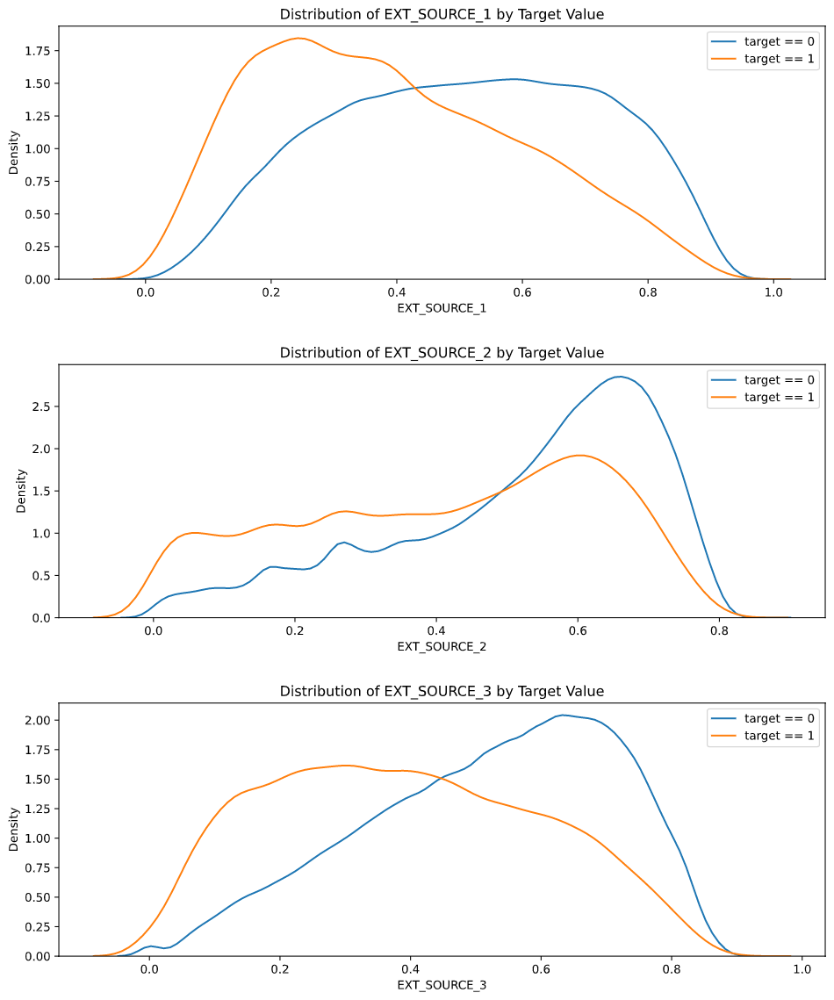

可以看出，在以上三张图中都能很好地区分违约与未违约这两条曲线。其中EXT_SOURCE_3的效果最好，当其值较小时，有更大概率发生违约。而EXT_SOURCE_2虽然也能很好区分两条曲线，但是两曲线的整体趋势非常相似，所以也许它在模型的效果会不如另两个特征。


##### 4.2.5 地区评分(REGION_RATING)的分布

```python
for i, source in enumerate(['REGION_RATING_CLIENT', 'REGION_RATING_CLIENT_W_CITY']):
    plt.figure(figsize = (5, 3))
    tot = app_train[app_train['TARGET']!=-1].groupby(source).count()['TARGET']
    default = app_train[app_train['TARGET']==1].groupby(source).count()['TARGET']
    plt.bar(tot.index, default / tot, width=0.35)
    
    # Label the plots
    plt.title('Distribution of %s ' % source)
    plt.xlabel('%s' % source); plt.ylabel('Default Rate');
    plt.show()
```

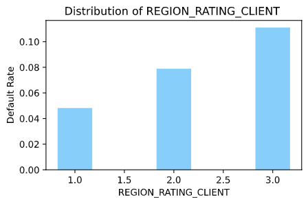 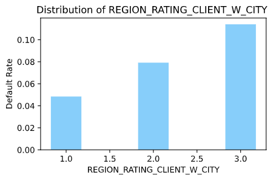

图中柱状图表示的是违约率即违约客户占总客户的比例。两个特征都呈现出一样的趋势，即评分越高则违约率越大。可以看出这两张柱状图的趋势和数值都非常相似，所以我们推测这两个特征的相关性应该非常高，接下来进行具体分析。


##### 4.2.6 特征间的相关度

由于本数据集特征过多，不适合对所有特征进行相关度可视化，所以这一部分我们只选取了上面讨论过的六个特征进行分析。

```python
# Extract the EXT_SOURCE variables and show correlations
ext_data = app_train[['TARGET', 'EXT_SOURCE_1', 'EXT_SOURCE_2', 'EXT_SOURCE_3', 'DAYS_BIRTH', 'REGION_RATING_CLIENT', 'REGION_RATING_CLIENT_W_CITY']]
ext_data_corrs = ext_data.corr()

# Heatmap of correlations
plt.figure(figsize = (6, 6))
sns.heatmap(ext_data_corrs, cmap = plt.cm.RdYlBu_r, vmin = -0.6, annot = True, vmax = 0.6)
plt.title('Correlation Heatmap');
```

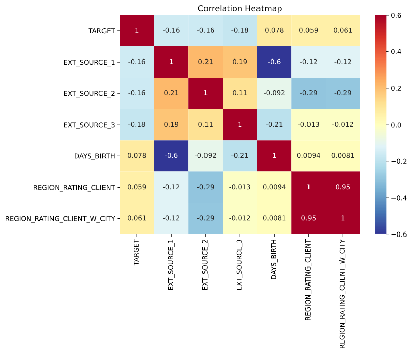

上面的热力图中，颜色越深表示二者之间相关度越高。可以看出两个REGION_RATING类特征有高达0.95的相关性，这两个特征都是对客户所在地区的评分，二者的差异仅在于：客户所在城市是否在考虑范围内，于是我们可以认为，它们包含的信息是基本一致的，在特征工程中我们会考虑删除这两个特征中的一个，以提高效率。此外，EXT_SOURCE_1和年龄的相关度也有0.6，这说明年龄可能是影响EXT_SOURCE_1得分的一个重要因素。


#### 4.3 数据预处理

数据预处理包括标称属性编码、缺失值填充、数据规范化等。但由于不同模型对数据的要求不同，我们并没有统一做数据预处理，而是每个模型各处理一次，具体参照后文。


### 五、特征工程

> note: 这一部分在feature_engineering.ipynb中实现。

本项目中的特征工程，主要分为新特征衍生和特征降维两部分。在新特征衍生部分，我们将尝试使用多项式特征构造法、专业知识特征构造法以及特征自动生成工具来衍生出新特征，并保留其中效果较好的参与建模。在特征降维中，我们会去除一些贡献度较小的特征：如缺失值过多的特征、与Target相关度过小的特征、共线特征等，以提高模型的效率。

#### 5.1 新特征衍生

##### 5.1.1 多项式特征

多项式特征是一种非常简单的特征构造方法，其衍生的新特征为原有特征的n次多项式，形如f1 * f2 ^ 2，f3 ^ 3。实操中，我们参考了[GitHub上的一篇文章]( https://jakevdp.github.io/PythonDataScienceHandbook/05.04-feature-engineering.html )【1】。

Dcikit-Learn直接为我们提供了一个PolynomialFeatures的类来构造多项式特征，创建该类的实例时需要传入一个参数degree，即为多项式的最高幂次。为了避免模型出现过拟合，degree不应取得过高。项目中我们将degree设为3，使用上文分析过的年龄、EXT_SOURCE作为原始特征，尝试构造多项式特征。具体操作如下。

```python
from sklearn.preprocessing import PolynomialFeatures

# Select features
poly_features = app_train[['EXT_SOURCE_1', 'EXT_SOURCE_2', 'EXT_SOURCE_3', 'DAYS_BIRTH', 'TARGET']]

# Create the polynomial object with specified degree
poly_transformer = PolynomialFeatures(degree = 3)

# Train the polynomial features
poly_transformer.fit(poly_features)

# Transform the features
poly_features = poly_transformer.transform(poly_features)
poly_features_test = poly_transformer.transform(poly_features_test)
```

计算新特征与Target的相关性并进行可视化，结果如下。（相关性大小已取绝对值）

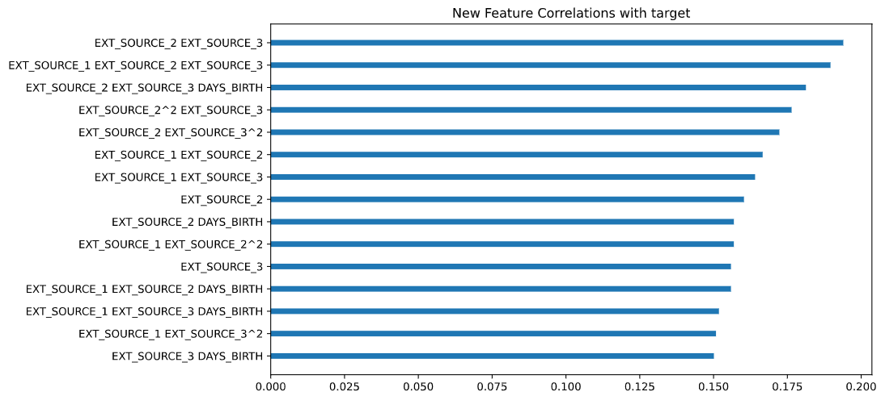

可以看出，许多特征的相关性超过了原有特征。排在前几的特征均为EXT_SOURCE特征的乘积。效果最好的新特征为EXT_SOUCE_2 * EXT_SOURCE_3，其相关性达到了0.19，相比原特征EXT_SOUCE_2的0.16略有提升。但也需注意，EXT_SOURCE_2 在于 DAYS_BIRTH相乘后产生的新特征，相关性反而较EXT_SOURCE_2略有下降。

最终，我们选定了在相关性中排名前十的特征，把它们加入到数据集中参与建模。


##### 5.1.2 专业知识特征

专业知识特征是利用金融知识和经验，人为地构造一些我们主观上认为可能会影响客户违约情况的新特征。

由于我们的金融知识有限，所以这一部分我们参考了[Kaggle上的一篇文章](https://www.kaggle.com/willkoehrsen/start-here-a-gentle-introduction)，构造出以下四个特征。

*  CREDIT_INCOME_PERCENT ：信用额度(credit)占客户收入(income)的百分比
*  ANNUITY_INCOME_PERCENT  ：贷款年金(annuity)占客户收入(income)的百分比
*  ANNUITY_CREDIT_PERCENT ：贷款年金(annuity)占信用额度(credit)的百分比
*  DAYS_EMPLOYED_PERCENT ：客户工作天数(days_employed)占年龄(days_birth)的百分比

```python
app_train_domain = app_train.copy()

app_train_domain['CREDIT_INCOME_PERCENT'] = app_train_domain['AMT_CREDIT'] / app_train_domain['AMT_INCOME_TOTAL']
app_train_domain['ANNUITY_INCOME_PERCENT'] = app_train_domain['AMT_ANNUITY'] / app_train_domain['AMT_INCOME_TOTAL']
app_train_domain['ANNUITY_CREDIT_PERCENT'] = app_train_domain['AMT_ANNUITY'] / app_train_domain['AMT_CREDIT']
app_train_domain['DAYS_EMPLOYED_PERCENT'] = app_train_domain['DAYS_EMPLOYED'] / app_train_domain['DAYS_BIRTH']
```

对上面四个特征进行可视化分析，得到分布图和相关性柱状图如下：

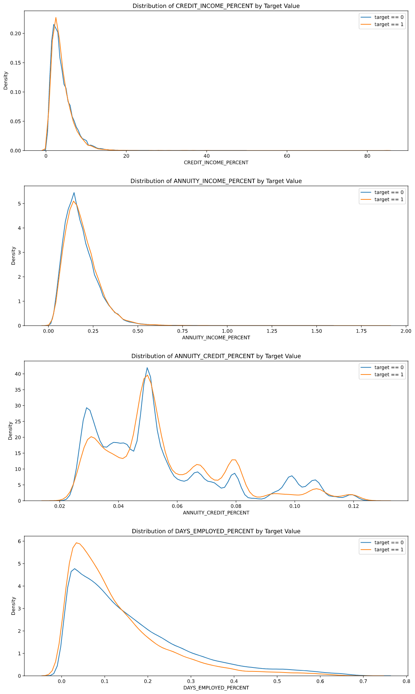

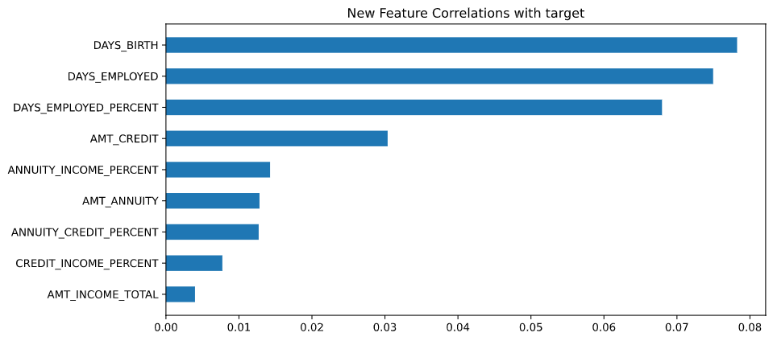

从分布图来看，前两个特征(CREDIT_INCOME, ANNUITY_INCOME)的违约未违约曲线拟合度非常高，所以效果应该不是很好。后两个特征(ANNUITY_CREDIT, DAYS_EMPLOYED)的曲线有较明显的差异，但是不同客户的曲线趋势仍是一致的。从相关性来看，各个新特征的相关性都较高，或基于原特征有部分提升。至于这些特征对我们的模型具体有多大的贡献，还需要在建模时进行实验。


##### 5.1.3 特征生成工具 Feature Tools

featuretools是一个生成新特征的库，它基于深度特征综合(Deep Feature Synthesis)的方法，从一组相关表中自动创建新特征。使用时需要先初始化一个EntitySet，之后把我们所拥有的数据表(Entity)加入到其中，指定原函数(primitive)后，直接调用DFS方法即可自动生成新特征。

原函数(primitive)可以分为Aggregation和Transform两种。其中Aggregation主要针对允许ID重复的子数据集，提供如min、sum这样的函数对同一ID在某一特征上的不同数值进行计算，从而产生新特征，比如把某一客户过去多次借贷记录中的最大金额作为新特征。Transform则针对单个数据集中的一个或多个特征列，提供absolute、diff这样的函数，比如把某两个特征的差值作为新特征。

在我们的项目中，只有一个数据集，所以只使用Transform函数。通过下面的代码可以查看具体的Transform函数。

```python
primitives = ft.list_primitives()
pd.options.display.max_colwidth = 100
primitives[primitives['type'] == 'transform'].head()
```

输出：

|      | name     | type      | description                                                |
| :--- | :------- | :-------- | ---------------------------------------------------------- |
| 19   | absolute | transform | Absolute value of base feature.                            |
| 20   | year     | transform | Transform a Datetime feature into the year.                |
| 21   | compare  | transform | For each value, determine if it is equal to another value. |
| 22   | month    | transform | Transform a Datetime feature into the month.               |
| 23   | week     | transform | Transform a Datetime feature into the week.                |

我们的数据集中所有的特征都已经处理为数值特征，所以暂选取了以下几个函数进行特征生成：

```python
default_trans_primitives =  ["diff", "divide_by_feature", "absolute", "haversine"]
```

将DFS的max_depth设置为2(即最多使用两个函数)，这样我们最后得到了1681个特征，部分特征如下：

```
[<Feature: ABSOLUTE(DIFF(WALLSMATERIAL_MODE_Block))>,
 <Feature: ABSOLUTE(DIFF(WALLSMATERIAL_MODE_Mixed))>,
 <Feature: ABSOLUTE(DIFF(WALLSMATERIAL_MODE_Monolithic))>,
 <Feature: ABSOLUTE(DIFF(WALLSMATERIAL_MODE_Others))>,
 <Feature: ABSOLUTE(DIFF(WALLSMATERIAL_MODE_Panel))>,
 <Feature: ABSOLUTE(DIFF(WALLSMATERIAL_MODE_Stone, brick))>,
 <Feature: ABSOLUTE(DIFF(WALLSMATERIAL_MODE_Wooden))>,
 <Feature: ABSOLUTE(DIFF(WEEKDAY_APPR_PROCESS_START_FRIDAY))>,
 <Feature: ABSOLUTE(DIFF(WEEKDAY_APPR_PROCESS_START_MONDAY))>,
 <Feature: ABSOLUTE(DIFF(WEEKDAY_APPR_PROCESS_START_SATURDAY))>]
```

可以看出，featuretools只是简单粗暴地按照我们的设定，对函数和原特征进行排列组合产生新特征。这样产生的特征数量过多，且没法像前两种方法一样保证新特征的效果。此外，由于我们的数据量比较大，使用featuretools会耗费过多的时间，比如在我们参考文章的案例中，仅仅是构造新特征的时间就超过了1个小时。

所以最终我们决定，本次项目中对featuretools的探索就到此为止，实际建模时不采用这种方法衍生新特征。


#### 5.2 特征降维

本次项目原始数据集的特征有121个，在对标称属性进行编码、新特征衍生之后，特征数达到了两百多个。为了减少不必要的运算，我们进行特征降维，去除一些贡献过小的特征。

##### 5.2.1 共线特征

数据集中，有许多特征之间的相关性非常高，这造成了数据的冗余。对于一组相关性较高的特征，只需要保留其中一个特征即可。

我们首先获得所有数值特征之间的相关性矩阵，并对它取绝对值、转换成上三角的形式。

```python
# Absolute value correlation matrix
corr_matrix = app_train_nf.corr().abs()

# Upper triangle of correlations
upper = corr_matrix.where(np.triu(np.ones(corr_matrix.shape), k=1).astype(np.bool))
```

之后，我们设定一个阈值threshold，相关性大于该阈值则被认为是共线特征，需要被去除，将它们加入到to_drop列表中。

```python
# Select columns with correlations above threshold
to_drop = [column for column in upper.columns if any(upper[column] > threshold)]
```

阈值设定为0.975时，to_drop中有25个特征需要删除；阈值设定为0.99时，有18个特征需要删除，如：'FLAG_EMP_PHONE' - 是否提供工作电话、'APARTMENTS_MEDI' - 公寓为中等大小等。

为了避免损失重要的数据，我们在这里较为保守地将阈值设定为0.99，并删除了这18个特征。

```python
app_train_nf = app_train_nf.drop(columns = to_drop)
app_test_nf = app_test_nf.drop(columns = to_drop)
```


##### 5.2.2 缺失值过多特征

特征的缺失值需要我们对其行填充，我们实际上是在向数据集中加入本不存在的数据。如果一个特征的缺失值太多，那么大部分数据都是我们所“编造”的，这样的特征会使数据偏离真实，从而使模型的效果变差。所以我们需要删除缺失值过多的特征。删除的阈值需要谨慎选取，我们在这里选取了参考文章中的“0.75”作为阈值。

首先看看训练集、测试集中的缺失情况。

```python
# Train missing values (in percent)
train_missing = (app_train_nf.isnull().sum() / len(app_train_nf)).sort_values(ascending = False)
train_missing.head(10)
```

输出：

```
COMMONAREA_MODE             0.698723
COMMONAREA_AVG              0.698723
NONLIVINGAPARTMENTS_MODE    0.694330
NONLIVINGAPARTMENTS_AVG     0.694330
FONDKAPREMONT_MODE          0.683862
LIVINGAPARTMENTS_AVG        0.683550
LIVINGAPARTMENTS_MODE       0.683550
FLOORSMIN_AVG               0.678486
FLOORSMIN_MODE              0.678486
YEARS_BUILD_AVG             0.664978
dtype: float64
```

可以看出所有特征的缺失都没有超过0.7。并且只有20个特征的缺失率超过0.5。所以看来，本数据集的数据缺失情况还是可以忍受的，我们在这一步不需要删除任何特征。


##### 5.3.3 重要性较低特征

这一步需要训练基于树的模型，并得到模型中特征的重要性(importance)，并删除重要性为0的特征。

我们使用了LGBM模型进行训练，并重复两次，对特征重要性取了平均值。得到的结果中，有49个特征的重要性为0.

```
There are 49 features with 0.0 importance
		feature	importance
70		70		0.0
208		208		0.0
151		151		0.0
184		184		0.0
181		181		0.0
```

对特征重要性归一化之后，进行可视化的结果如下：

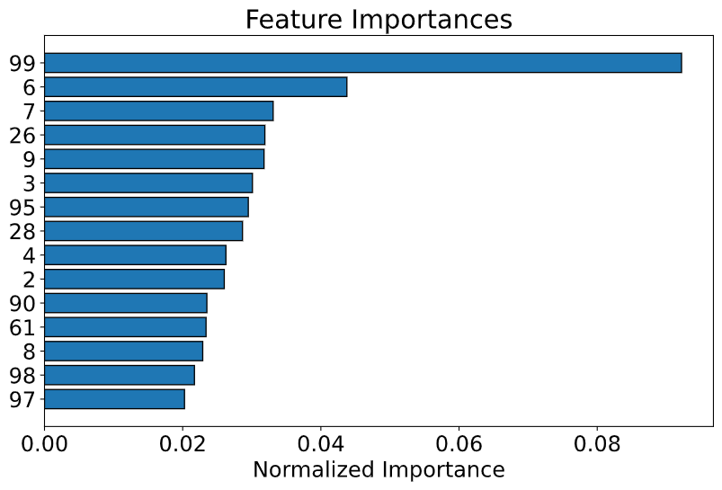

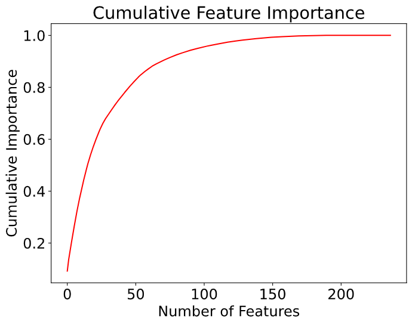

第二张图表示的特征重要性的积累曲线，它说明了在我们的237个特征之中，只需要前145个就可以达到0.99的特征重要性。这也为我们进行特征降维提供了一个思路，如果想要更快的训练速度，我们可以牺牲一点准确性，只保留前145个特征。不过，在我们的项目中，并不采用这种方法进行特征降维。

最后，由于我们的项目是以探究学习为目的，没有必要过分追求效率，所以我们决定保留这49个重要性为0的特征。


### 六、研究方法与模型思路


### 七、实验与分析


### 八、结论与展望


### 参考文献

